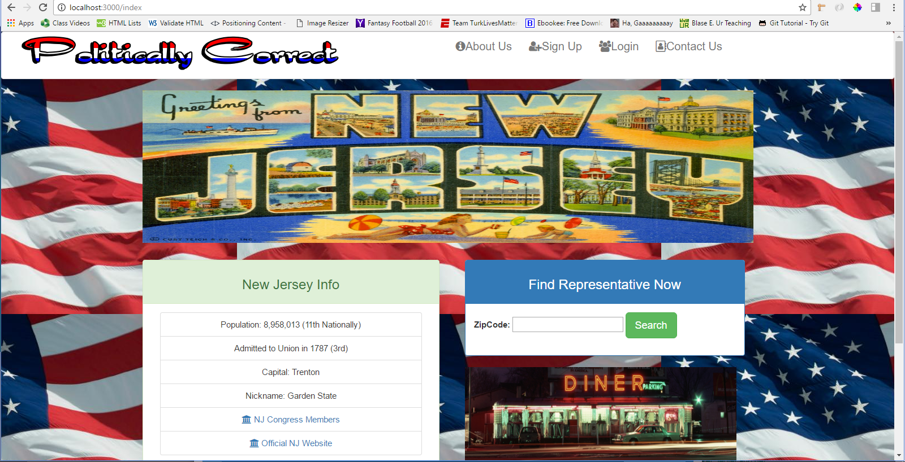

# PoliticallyCorrect

Easy access to information regarding all local and state representatives. App allows user to sign-in and using the zip code they provided the site will render their local representative and their corresponding information. 

## Screenshots 

#### Landing Page



## Technologies used

- Bootstrap (http://getbootstrap.com/)
- Font-Awesome (http://fontawesome.io/)
- npm express (https://www.npmjs.com/package/express)
- npm body-parser (https://www.npmjs.com/package/body-parser)
- npm method-override (https://www.npmjs.com/package/method-override)
- npm handlebars (https://www.npmjs.com/package/handlebars)
- npm express-handlebars (https://www.npmjs.com/package/express-handlebars)
- npm mysql (https://www.npmjs.com/package/mysql)
- npm sequelize (https://www.npmjs.com/package/sequelize)
- npm path (https://www.npmjs.com/package/path)
- npm passport-local (https://www.npmjs.com/package/passport-local)
- npm passport (https://www.npmjs.com/package/passport)
- npm cookie-parser (https://www.npmjs.com/package/cookie-parser)
- npm express-session (https://www.npmjs.com/package/express-session)
- npm dotenv (https://www.npmjs.com/package/dotenv)
- npm bcryptjs (https://www.npmjs.com/package/bcryptjs)
- npm chai (https://www.npmjs.com/package/chai)


## Getting Started

heroku link: https://politicallycorrect.herokuapp.com/ 

### Prerequisities

```
- Clone the Github repo down onto local machine. Open up the directory in which the repo was cloned into, and do an npm install. The package.json should install all of the npm packages that are dependencies. Once those packages are installed you can copy the db directory schema.sql file and create a database in mySQL workbench by pasting it and running it. After that you can go to the seeders directory and the the same with the seeds.sql file. You can now run node server.js in your terminal or GitBash and go to a browser and type "localhost:3000". You are now ready to use the PoliticallyCorrect app.

```


## Built With

* Sublime Text - Text editor of choice
* Bootstrap - Wireframes of choice, Modals used to simplify design
* Node - Makes removal and addition of new objects simpler
* Express.js - A Node.js web application server framework, designed for building single-page, multi-page, and hybrid web applications. It is the de facto standard server framework for node.js
* Sequelize - A promise-based ORM for Node.js and io.js. It supports the dialects PostgreSQL, MySQL, MariaDB, SQLite and MSSQL and features solid transaction support, relations, read replication and more.

## Walk throughs of code 


```


```

## Authors

*  **Annie G**  MVC, Sequelize, Model Creation, Associations  - [Annie](https://github.com/annieg11)
*  **Donald N**  User Authentication, Controller Routes  - [Donald](https://github.com/dln5057)
*  **Muhammet A**  Handlebars, Controller Routes, GitHub Workflow, SEO, Integration, CSS Animations  - [Muhammet](https://github.com/muhammeta7)
*  **Meredith W**  CSS, Animations, and SEO integration  - [Meredith](https://github.com/Meredith-W)

## Acknowledgments

* Thanks to all of the the team members for their contributions to this project.
* Also thanks to Dan, Nate, and Jimmy for all their help.  
* Inspiration: To help the general public easily access representative information.